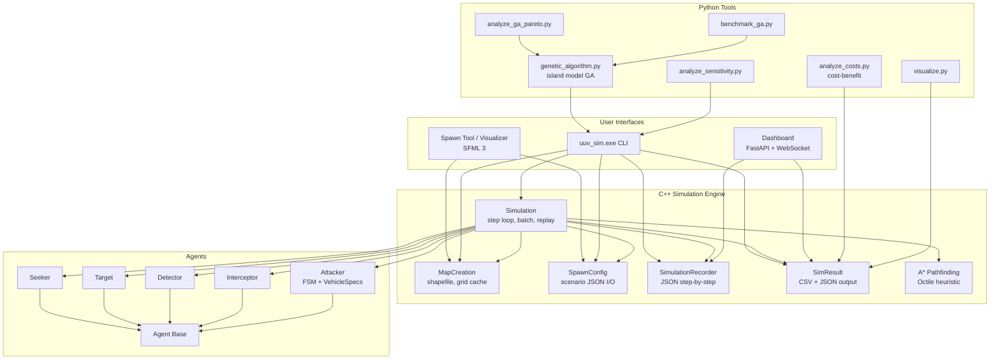
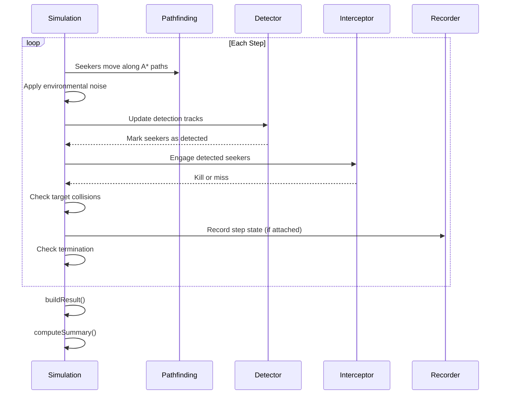
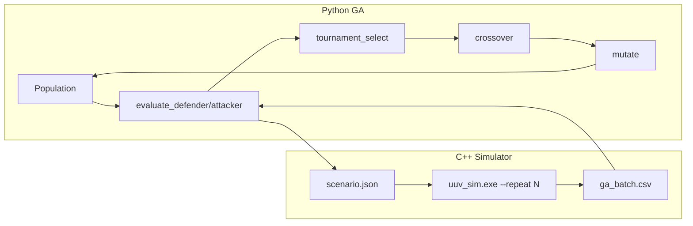

# Architecture Diagram

## High-Level System Architecture

```mermaid
graph TB
    subgraph "User Interfaces"
        GUI[Spawn Tool / Visualizer<br/>SFML 3]
        CLI[uuv_sim.exe CLI]
        DASH[Dashboard<br/>FastAPI + WebSocket]
    end

    subgraph "C++ Simulation Engine"
        SIM[Simulation<br/>step loop, batch, replay]
        MAP[MapCreation<br/>shapefile, grid cache]
        SPAWN[SpawnConfig<br/>scenario JSON I/O]
        REC[SimulationRecorder<br/>JSON step-by-step]
        RES[SimResult<br/>CSV + JSON output]
        PF[A* Pathfinding<br/>Octile heuristic]
    end

    subgraph "Agents"
        AG[Agent Base]
        SK[Seeker]
        TG[Target]
        DT[Detector]
        IC[Interceptor]
        AK[Attacker<br/>FSM + VehicleSpecs]
    end

    subgraph "Python Tools"
        GA[genetic_algorithm.py<br/>island model GA]
        ACOST[analyze_costs.py<br/>cost-benefit]
        APAR[analyze_ga_pareto.py]
        ASENS[analyze_sensitivity.py]
        VIZ[visualize.py]
        BENCH[benchmark_ga.py]
    end

    GUI --> MAP
    GUI --> SPAWN
    CLI --> MAP
    CLI --> SPAWN
    CLI --> SIM
    CLI --> REC
    CLI --> RES

    SIM --> MAP
    SIM --> SPAWN
    SIM --> PF
    SIM --> REC
    SIM --> RES

    SIM --> SK
    SIM --> TG
    SIM --> DT
    SIM --> IC
    SIM --> AK

    SK --> AG
    TG --> AG
    DT --> AG
    IC --> AG
    AK --> AG

    DASH --> RES
    DASH --> REC
    GA --> CLI
    ACOST --> RES
    APAR --> GA
    ASENS --> CLI
    VIZ --> RES
    BENCH --> GA
```

## Simulation Step Flow

```mermaid
sequenceDiagram
    participant S as Simulation
    participant PF as Pathfinding
    participant D as Detector
    participant I as Interceptor
    participant R as Recorder

    loop Each Step
        S->>PF: Seekers move along A* paths
        S->>S: Apply environmental noise
        S->>D: Update detection tracks
        D-->>S: Mark seekers as detected
        S->>I: Engage detected seekers
        I-->>S: Kill or miss
        S->>S: Check target collisions
        S->>R: Record step state (if attached)
        S->>S: Check termination
    end
    S->>S: buildResult()
    S->>S: computeSummary()
```

## GA Integration Flow

```mermaid
graph LR
    subgraph "Python GA"
        POP[Population]
        EVAL[evaluate_defender/attacker]
        SELECT[tournament_select]
        CROSS[crossover]
        MUT[mutate]
    end

    subgraph "C++ Simulator"
        SCEN[scenario.json]
        SIM[uuv_sim.exe --repeat N]
        CSV[ga_batch.csv]
    end

    POP --> EVAL
    EVAL --> SCEN
    SCEN --> SIM
    SIM --> CSV
    CSV --> EVAL
    EVAL --> SELECT
    SELECT --> CROSS
    CROSS --> MUT
    MUT --> POP
```
